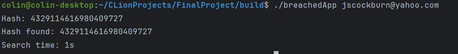
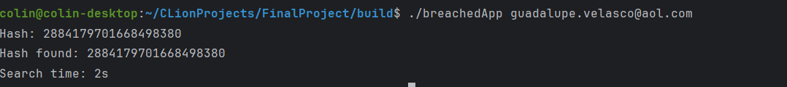

# **Breached Project for EE462**
Authored By: Colin Gasiewicz
### Project Goals
 - Create fast creation and searching of emails from breached password text file
 - Generate hashes for email and password and store them in `data/hashed.txt`
 - Fast search for hash in `data/hashedtxt` 
### Important Information
 - `/data` directory must contain `realCredentials.txt` in order for the program to work
 - executables and object files placed in `/build`
#### Usage of program
```
./breachedApp <email_string>
```
will make `data/hashed.txt` and write hashed data and search for <email_string> 
the user inputted argument of an email address to search for
### Sources used
 -  [cplusplus.com](https://cplusplus.com/) For c++ documentation on hash, thread, string, etc...
 - Various past stackoverflow posts about multiple issues with threading and hashing in C++
 - Course textbook code
 - Did the same project for another class
 - CLion IDE on SSH
 - No AI used
### Tests
- Conducted on my personal linux computer

#### Test 1
Good input email


#### Test 2
Good input email


#### Test 3
Good input email


#### Test 4 
Bad input email


### Challenges encountered
  - The operator function needs to be a non-static member function caused issues
  - Threads finding the hash and not stopping other threads
  - Threads not finding the hash
  - Does **NOT** run on Polaris unfortunately
### Future Improvements
  - Compatability with c++99 and lowering dependencies (i.e. polaris)
  - Utilizing a database to store this hashes would be less code and easier to expand and would make building a web ui possiable
  - An algorithmic approach to search for the data would speed up results further
  - Create a proper project directory for storing files
  - Using a `std::set` or `std::map` for storage of hashes